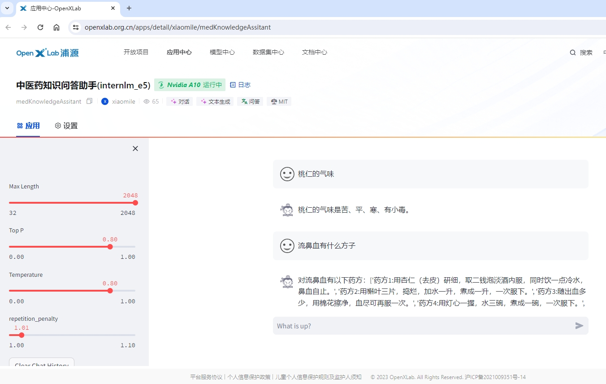

# 中医药知识问答助手

***OpenXLab 体验地址：https://openxlab.org.cn/apps/detail/xiaomile/ChineseMedicalAssistant_internlm2***

***中医药知识问答助手 模型下载地址：https://openxlab.org.cn/models/detail/xiaomile/ChineseMedicalAssistant_internlm2***

> *此仓库主要用于将 中医药知识问答助手 项目部署到 OpenXLab 。*

## 介绍

&emsp;&emsp;中医药知识问答助手是利用医学百科中的本草纲目所记录的每项中药的数据，基于[InternLM2](https://github.com/InternLM/InternLM.git)进行LoRA微调得到的医学类的问答模型。

> 中医药知识是传承几千年的知识瑰宝，其中《本草纲目》是一部集大成的经典著作。作者是明朝的李时珍，撰成于万历六年（1578 年），万历二十三年（1596年）在金陵(今南京)正式刊行。全书五十二卷，收载药物 1892 种，附药图 1100 余幅，阐发药物的性味、主治、用药法则、产地、形态、采集、炮制 、方剂配伍等，并载附方 10000 余。
李时珍用了大约27年的时间才修改编写完成《本草纲目》，经过了三次改写，于万历六年（1578 年）才最终完成。在这个过程中，李时珍参考了800多种书籍，多次去各地进行实地考察，采集样本，耗费了他非常大的心血。

&emsp;&emsp;中医药知识问答助手，实现以《本草纲目》为切入点，打造一套基于中医药知识百科的**个性化 AI** 微调大模型完整流程，同时也在探索AI时代下中医药知识传承的载体形式。

> 具体如何实现全流程的 Character-AI 微调，可参考主仓库-[ChineseMedicalAssistant](https://github.com/xiaomile/ChineseMedicalAssistant.git)。
> 
> 如何学习大模型部署和微调请参考：[开源大模型食用指南](https://github.com/datawhalechina/self-llm.git) 以及 [书生·浦语大模型实战营课程](https://github.com/InternLM/tutorial.git)

&emsp;&emsp;***欢迎大家来给[InternLM2](https://github.com/InternLM/InternLM.git)，点点star哦~***

## *News*

***
***


## OpenXlab 模型

&emsp;&emsp;中医药知识问答助手使用的是 InternLM2 的 7B 模型，模型参数量为 7B，模型已上传 [中医药知识问答助手(InternLM2-chat-7b)](https://openxlab.org.cn/models/detail/xiaomile/ChineseMedicalAssistant_internlm2) ,可以直接下载推理。

## 数据集

&emsp;&emsp;中医药知识问答助手 数据集采用中的本草纲目所记录的每项中药的数据，共计 7000 余条，数据集样例：

```text
input:韭哪个部类
output:韭所属的部是菜部
input:韭别名是什么
output:韭的名称解释是草钟乳、起阳草。
input:韭吃起来苦嘛
output:韭的气味是韭：辛、微酸、温、涩、无毒。韭子：辛、甘、温、无毒。
input:韭可以治什么症状
output:韭的功效是主治：赤白带下;喘息欲绝;疮癣;刀伤出血;盗汗;耳出汁;痢疾;漆疮作痒;伤寒劳复（按：指伤寒病后，身体未复原而性交，引起旧病复发）;食物中毒;消渴;胸痹急痛（痛如锥刺，不能俯仰，自汗）;阴阳易病（男子因房事不慎，引起阴部肿大，小腹绞痛，头重眼花）
```

&emsp;&emsp;使用脚本将本草纲目中关于药材的释名、气味和主治抓取下来，作为数据集使用。

## 微调

&emsp;&emsp;使用 XTuner 训练， XTuner 有各个模型的一键训练脚本，很方便。且对 InternLM2 的支持度最高。

### XTuner

&emsp;&emsp;使用 XTuner 进行微调，具体脚本可参考[internlm2_chat_7b_qlora_oasst1_e3_copy.py](./train/internlm2_chat_7b_qlora_oasst1_e3_copy.py)，该脚本在`train`文件夹下。脚本内有较为详细的注释。

## OpenXLab 部署 中医药知识问答助手

&emsp;&emsp;仅需要 Fork 本仓库，然后在 OpenXLab 上创建一个新的项目，将 Fork 的仓库与新建的项目关联，即可在 OpenXLab 上部署 中医药知识问答助手。

&emsp;&emsp;***OPenXLab 中医药知识问答助手  https://openxlab.org.cn/apps/detail/xiaomile/ChineseMedicalAssistant_internlm2***



## LmDeploy部署

- 首先安装LmDeploy

```shell
pip install -U 'lmdeploy[all]==v0.1.0'
```

- 然后转换模型为`turbomind`格式。使用 TurboMind 推理模型需要先将模型转化为 TurboMind 的格式，，目前支持在线转换和离线转换两种形式。TurboMind 是一款关于 LLM 推理的高效推理引擎，基于英伟达的 FasterTransformer 研发而成。它的主要功能包括：LLaMa 结构模型的支持，persistent batch 推理模式和可扩展的 KV 缓存管理器。
本项目采用离线转换，需要在启动服务之前，将模型转为 lmdeploy TurboMind 的格式，如下所示。

> --dst-path: 可以指定转换后的模型存储位置。

```shell
lmdeploy convert internlm2-chat-7b  要转化的模型地址 --dst-path 转换后的模型地址
```
执行完成后将会在当前目录生成一个 workspace 的文件夹。

- LmDeploy Chat对话。模型转换完成后，我们就具备了使用模型推理的条件，接下来就可以进行真正的模型推理环节。
1、本地对话（Bash Local Chat）模式，它是跳过API Server直接调用TurboMind。简单来说，就是命令行代码直接执行 TurboMind。
```shell
lmdeploy chat turbomind 转换后的turbomind模型地址/workspace
```

- 网页Demo演示。本项目采用将TurboMind推理作为后端，将Gradio作为前端Demo演示。
```shell
# Gradio+Turbomind(local)
lmdeploy serve gradio 转换后的turbomind模型地址/workspace
```
就可以直接启动 Gradio，此时没有API Server，TurboMind直接与Gradio通信。

## Lmdeploy&opencompass 量化以及量化评测  
> 进行量化决策流程
> Step1:尝试正常版本，评估效果。效果一般，启动量化。
> Step2:开展KV Cache量化，以减少中间过程计算结果对显存的占用。评估量化效果。
### `KV Cache`量化 
- 计算与获得量化参数
  >计算 minmax。主要思路是通过计算给定输入样本在每一层不同位置处计算结果的统计情况。
  >在计算minmax的命令行中，会选择128条输入样本，每条样本长度为 2048，数据集选择ptb，输入模型后就会得到上面的各种统计值。
```shell
# 计算 minmax
lmdeploy lite calibrate \
  --model  模型路径 \
  --calib_dataset "ptb" \
  --calib_samples 128 \
  --calib_seqlen 2048 \
  --work_dir ./quant_output #参数保存路径
```
  >通过minmax获取量化参数。主要利用下面公式来获取每一层的KV中心值（zp）和缩放值（scale）。
```shell
zp = (min+max) / 2
scale = (max-min) / 255
quant: q = round( (f-zp) / scale)
dequant: f = q * scale + zp
```
  >有了这两个值就可以进行量化和反量化操作。具体来说就是对历史存储中的K和V做量化，使用时再反量化。使用如下命令：
```shell
# 通过 minmax 获取量化参数
lmdeploy lite kv_qparams \
  --work_dir ./quant_output #参数保存路径 \
  --turbomind_dir workspace/triton_models/weights/ #转换后模型路径 \
  --kv_sym False \
  --num_tp 1
```
- 修改配置。修改weights/config.ini文件，把quant_policy改为4，从而打开KV int8开关。
```shell
tensor_para_size = 1
session_len = 2056
max_batch_size = 64
max_context_token_num = 1
step_length = 1
cache_max_entry_count = 0.5
cache_block_seq_len = 128
cache_chunk_size = 1
use_context_fmha = 1
quant_policy = 4
max_position_embeddings = 2048
rope_scaling_factor = 0.0
use_logn_attn = 0
```
  >至此就完成了KV Cache量化。
- 评估量化效果。编写评测文件`configs/eval_turbomind.py`
```python
from mmengine.config import read_base
from opencompass.models.turbomind import TurboMindModel

with read_base():
 # choose a list of datasets   
  from .datasets.ceval.ceval_gen import ceval_datasets 
 # and output the results in a choosen format
  from .summarizers.medium import summarizer

datasets = [*ceval_datasets]

internlm2_chat_7b = dict(
     type=TurboMindModel,
     abbr='internlm2-chat-7b-turbomind',
     path='转换后的模型地址',
     engine_config=dict(session_len=512,
         max_batch_size=2,
         rope_scaling_factor=1.0),
     gen_config=dict(top_k=1,
         top_p=0.8,
         temperature=1.0,
         max_new_tokens=100),
     max_out_len=100,
     max_seq_len=512,
     batch_size=2,
     concurrency=1,
     #  meta_template=internlm_meta_template,
     run_cfg=dict(num_gpus=1, num_procs=1),
)
models = [internlm2_chat_7b]
```
- 启动评测！
```shell
python run.py configs/eval_turbomind.py -w 指定结果保存路径
```
> Step3:开展W4A16量化，以减少模型参数计算结果对显存的占用。评估量化效果。W4A16中的A是指Activation，保持FP16，只对部分权重参数进行4bit量化
### `W4A16`量化 
- 计算与获得量化参数
  >计算 minmax。主要思路是通过计算给定输入样本在每一层不同位置处计算结果的统计情况。
  >在计算minmax的命令行中，会选择128条输入样本，每条样本长度为 2048，数据集选择ptb，输入模型后就会得到上面的各种统计值。
```shell
# 计算 minmax
lmdeploy lite calibrate \
  --model  模型路径 \
  --calib_dataset "ptb" \
  --calib_samples 128 \
  --calib_seqlen 2048 \
  --work_dir ./quant_output #参数保存路径
```
- 量化权重模型
  >利用上面得到的统计值对参数进行量化。
  >具体包括两步，分别是缩放参数和整体量化。
  >执行如下命令：
```shell
# 量化权重模型
lmdeploy lite auto_awq \
  --model  #模型存放路径 \
  --w_bits 4 \
  --w_group_size 128 \
  --work_dir ./quant_output #模型存放路径
```
  >命令中 w_bits表示量化的位数，w_group_size表示量化分组统计的尺寸，work_dir是量化后模型输出的位置。
  >因为没有 torch.int4，所以实际存储时，8个4bit权重会被打包到一个int32值中。
- 转换成 TurboMind 格式
```shell
# 转换模型的layout，存放在默认路径 ./workspace 下
lmdeploy convert  internlm-chat-7b ./quant_output #KV Cache量化后的模型路径\
    --model-format awq \
    --group-size 128
    --dst_path ./workspace_quant #转换后模型存放路径
```
  >这个group-size就是那个w_group_size。可以指定输出目录：--dst_path。
  >至此就完成了KV Cache量化。

- 评估量化效果。评测文件`configs/eval_turbomind.py`如上
- 启动评测！
```shell
python run.py configs/eval_turbomind.py -w 结果保存路径
```
结果文件可在同目录文件[results](./results)中获取

## OpenCompass 评测

- 安装 OpenCompass

```shell
git clone https://github.com/open-compass/opencompass
cd opencompass
pip install -e .
```

- 下载解压数据集

```shell
cp /share/temp/datasets/OpenCompassData-core-20231110.zip /root/opencompass/
unzip OpenCompassData-core-20231110.zip
```

- 评测启动！

```shell
python run.py \
    --datasets ceval_gen \
    --hf-path /root/model/huanhuan/kmno4zx/huanhuan-chat-internlm2 \
    --tokenizer-path /root/model/huanhuan/kmno4zx/huanhuan-chat-internlm2 \
    --tokenizer-kwargs padding_side='left' truncation='left'     trust_remote_code=True \
    --model-kwargs device_map='auto' trust_remote_code=True \
    --max-seq-len 2048 \
    --max-out-len 16 \
    --batch-size 2  \
    --num-gpus 1 \
    --debug
```
  

## 致谢

<div align="center">

***感谢上海人工智能实验室组织的 书生·浦语实战营 学习活动~***

***感谢 OpenXLab 对项目部署的算力支持~***

***感谢 浦语小助手 对项目的支持~***
</div>

