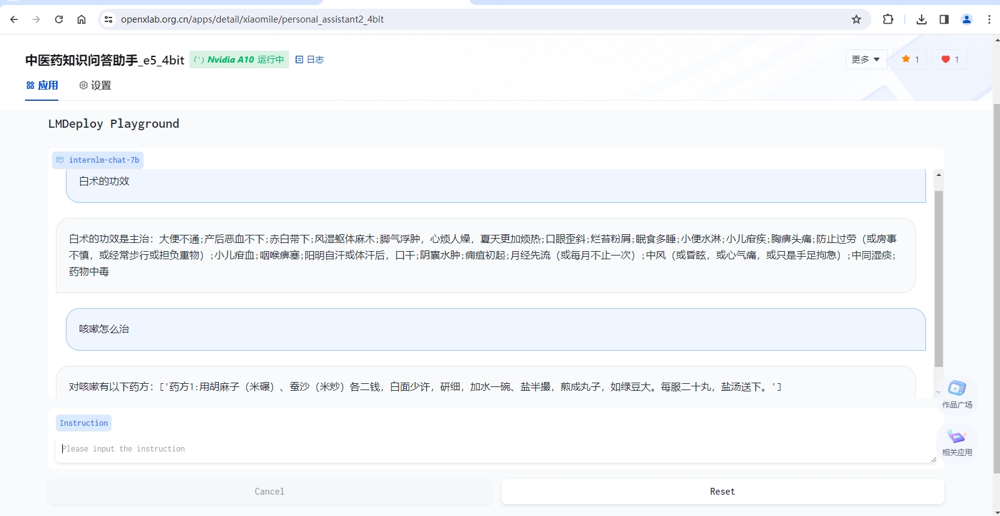

<div align="center"></div>

# 中医药知识问答助手

***OpenXLab 体验地址：https://openxlab.org.cn/apps/detail/xiaomile/medKnowledgeAssitant***

***中医药知识问答助手***

***下载地址（基座InternLM-chat-7b）：https://openxlab.org.cn/models/detail/xiaomile/ChineseMedicalAssistant_internlm***
[](https://openxlab.org.cn/models/detail/xiaomile/ChineseMedicalAssistant_internlm)

***下载地址（基座InternLM2-chat-1.8b）：https://openxlab.org.cn/models/detail/xiaomile/ChineseMedicalAssistant_internlm2_1_8b***
[](https://openxlab.org.cn/models/detail/xiaomile/ChineseMedicalAssistant_internlm2_1_8b)

***下载地址（基座InternLM2-chat-7b）：https://openxlab.org.cn/models/detail/xiaomile/ChineseMedicalAssistant_internlm2***
[](https://openxlab.org.cn/models/detail/xiaomile/ChineseMedicalAssistant_internlm2)

***下载地址（量化InternLM-chat-7b-4bit）：https://openxlab.org.cn/models/detail/LiyanJin/ChineseMedicalAssistant_Quant***
[](https://openxlab.org.cn/models/detail/LiyanJin/ChineseMedicalAssistant_Quant)

> *此仓库主要用于微调大模型 ，要将中医药知识问答助手部署到openxlab请参考[这个仓库](https://github.com/xiaomile/ChineseMedicalAssistant2)*

## 介绍

&emsp;&emsp;中医药知识问答助手是利用医学百科中的本草纲目所记录的每项中药的数据，基于[InternLM和InternLM2](https://github.com/InternLM/InternLM.git)进行LoRA微调得到的医学类的问答模型。

> 中医药知识是传承几千年的知识瑰宝，其中《本草纲目》是一部集大成的经典著作。作者是明朝的李时珍，撰成于万历六年（1578 年），万历二十三年（1596年）在金陵(今南京)正式刊行。全书五十二卷，收载药物 1892 种，附药图 1100 余幅，阐发药物的性味、主治、用药法则、产地、形态、采集、炮制 、方剂配伍等，并载附方 10000 余。
李时珍用了大约27年的时间才修改编写完成《本草纲目》，经过了三次改写，于万历六年（1578 年）才最终完成。在这个过程中，李时珍参考了800多种书籍，多次去各地进行实地考察，采集样本，耗费了他非常大的心血。

&emsp;&emsp;中医药知识问答助手，实现以《本草纲目》为切入点，打造一套基于中医药知识百科的**个性化 AI** 微调大模型完整流程，同时也在探索AI时代下中医药知识传承的载体形式。

> 具体如何实现全流程的 chat-AI 微调，可参考本仓库-[ChineseMedicalAssistant](https://github.com/xiaomile/ChineseMedicalAssistant.git)。
> 
> 如何学习大模型部署和微调请参考：[开源大模型食用指南](https://github.com/datawhalechina/self-llm.git) 以及 [书生·浦语大模型实战营课程](https://github.com/InternLM/tutorial.git)

&emsp;&emsp;***欢迎大家来给[InternLM](https://github.com/InternLM/InternLM.git)，点点star哦~***


## *Fun 轶事*

<details>
<summary> 偷偷联网 or 智能涌现</summary>
    <div align="center">
        
        
        
    </div>
</details>

> 在某一次微调后的测试中，小助手突然输出了一个名为“白术散”的药方。
>
> 起初这个并没有让我感到奇怪，直到我好奇在数据集里搜了一下“白术散”才发现压根没有这三个字
> 
> 后来在网上搜了一下白术散的相关信息，功效居然对的上。
>
> 这让我一度怀疑InternLM是不是有联网的功能。。。还是说这就是智能涌现！

<details>
    <summary> 彩蛋 </summary>
    <div align="center">
        
        
    </div>
</details>

> 上面情况的可以被解释为瞎猫碰着死老鼠，那这个阁下又如何应对？


## OpenXlab 模型

&emsp;&emsp;中医药知识问答助手使用的是 InternLM2和InternLM 的 7B 模型，模型参数量为 7B，模型已上传，可以直接下载推理。

| 基座模型| 微调数据量 | 训练次数 | 下载地址 |
|:------:|:------:|:-------:|:---------|
|InternLM-chat-7b|46933 conversations|5 epochs|[xiaomile/ChineseMedicalAssistant_internlm](https://openxlab.org.cn/models/detail/xiaomile/ChineseMedicalAssistant_internlm)|
|InternLM2-chat-7b|46933 conversations|5 epochs|[xiaomile/ChineseMedicalAssistant_internlm2](https://openxlab.org.cn/models/detail/xiaomile/ChineseMedicalAssistant_internlm2)|
|InternLM2-chat-1.8b|46933 conversations|3 epochs|[xiaomile/ChineseMedicalAssistant_internlm2_1_8b](https://openxlab.org.cn/models/detail/xiaomile/ChineseMedicalAssistant_internlm2_1_8b)|
|InternLM-chat-7b|469330 conversations|4 epochs|[xiaomile/ChineseMedicalAssistant_internlm_40w_e4](https://openxlab.org.cn/models/detail/xiaomile/ChineseMedicalAssistant_internlm_40w_e4)|
|InternLM-chat-7b|46933 conversations|3 epochs|[zongkang/ChineseMedicalAssistant](https://openxlab.org.cn/models/detail/zongkang/ChineseMedicalAssistant)|
|InternLM-chat-7b|469330 conversations|6 epochs|[zongkang/ChineseMedicalAssistant_chat_7b](https://openxlab.org.cn/models/detail/zongkang/ChineseMedicalAssistant_chat_7b)|
|InternLM-chat-7b|46933 conversations|5 epochs|[LiyanJin/ChineseMedicalAssistant_Quant](https://openxlab.org.cn/models/detail/LiyanJin/ChineseMedicalAssistant_Quant)|

## 数据集

&emsp;&emsp;中医药知识问答助手 数据集采用中的本草纲目所记录的每项中药的数据，共计 7000 余条，数据集样例：

```text
input:韭哪个部类
output:韭所属的部是菜部
input:韭别名是什么
output:韭的名称解释是草钟乳、起阳草。
input:韭吃起来苦嘛
output:韭的气味是韭：辛、微酸、温、涩、无毒。韭子：辛、甘、温、无毒。
input:韭可以治什么症状
output:韭的功效是主治：赤白带下;喘息欲绝;疮癣;刀伤出血;盗汗;耳出汁;痢疾;漆疮作痒;伤寒劳复（按：指伤寒病后，身体未复原而性交，引起旧病复发）;食物中毒;消渴;胸痹急痛（痛如锥刺，不能俯仰，自汗）;阴阳易病（男子因房事不慎，引起阴部肿大，小腹绞痛，头重眼花）
```

<details><summary>数据收集和整理过程</summary>

> 使用[脚本](getdatafromweb.py)将本草纲目中关于药材的释名、气味和主治按所属部分别抓取下来后，再整合成一个文件，作为数据使用。温馨提醒：千万别抓的太快，否则会被拉进小黑屋，别问我为什么知道。
>
> 从网上抓下来的数据,功效和药方是写在一起的，因此还需要经过将药方提炼出来，只保留主治的症状在功效描述里（由于功效描述大部分是格式固定的，因此可以使用re将其分离出来，分离可参考此[脚本](SplitEfficacyAndSymptomatology.py)）
>
> 脚本分离后还需经过几天的人工修正，才能得到[最终的效果](symptom.xlsx)
>
> 使用[脚本](xlsx2Andsympton2New.py)生成新的xlsx，准备创建数据集。
>
> 使用[脚本](xlsx2jsonl3.py)生成微调用的和测评用的jsonl格式数据集`train.jsonl`和`test.jsonl`，若需要重复随机数据，可将脚本中的repeat_times改成你想要重复的次数。

</details>

## 微调

&emsp;&emsp;使用 XTuner 训练， XTuner 有各个模型的一键训练脚本，很方便。且对 InternLM2 的支持度最高。

### XTuner

&emsp;&emsp;使用 XTuner 进行微调，具体脚本可参考`configs`文件夹下的脚本，脚本内有较为详细的注释。

|基座模型|配置文件|
|:---:|:---:|
|internlm-chat-7b|[internlm_chat_7b_qlora_e3_chineseMed.py](configs/internlm_chat_7b_qlora_e3_chineseMed.py)|
|internlm2-chat-7b|[internlm2_chat_7b_qlora_e3_chineseMed.py](configs/internlm2_chat_7b_qlora_e3_chineseMed.py)|

<details><summary>微调方法如下：</summary>

1. 根据基座模型复制上面的配置文件，将模型地址`pretrained_model_name_or_path`和数据集地址`data_path`修改成自己的，propmt模板`prompt_template`需要根据基座模型是InternLM还是InternLM2选择`PROMPT_TEMPLATE.internlm_chat`还是`PROMPT_TEMPLATE.internlm2_chat`，其他参数根据自己的需求修改，然后就可以开始微调（微调时间长的推荐使用tmux，免得万一和机器断开连接导致微调中断）

   ```bash
   xtuner train ${YOUR_CONFIG} --deepspeed deepspeed_zero2
   ```

   `--deepspeed` 表示使用 [DeepSpeed](https://github.com/microsoft/DeepSpeed) 🚀 来优化训练过程。XTuner 内置了多种策略，包括 ZeRO-1、ZeRO-2、ZeRO-3 等。如果用户期望关闭此功能，请直接移除此参数。

2. 将保存的 `.pth` 模型（如果使用的DeepSpeed，则将会是一个文件夹）转换为 HuggingFace Adapter 模型，即：生成 Adapter 文件夹：

   ```bash
   export MKL_SERVICE_FORCE_INTEL=1
   xtuner convert pth_to_hf ${YOUR_CONFIG} ${PTH} ${LoRA_PATH}
   ```

3. 将 HuggingFace Adapter 模型合并入 HuggingFace 模型：

    ```bash
    xtuner convert merge ${Base_PATH} ${LoRA_PATH} ${MERGED_PATH}
    ```

4. 若真的出现意外导致微调中段，可以从最近的 checkpoint 继续微调

   ```bash
   xtuner train ${YOUR_CONFIG} --deepspeed deepspeed_zero2 --resume ${LATEST_CHECKPOINT}
   ```

</details>

### Chat

微调结束后可以使用xtuner查看对话效果

```shell
xtuner chat ${MERGED_PATH} [optional arguments]
```

<details><summary>参数：</summary>
    
- `--prompt-template`: 指定对话模板，一代模型使用 internlm_chat，二代使用  internlm2_chat。
- `--system`:  指定SYSTEM文本
- `--system-template`:  指定SYSTEM模板
- `--bits`:  LLM位数，{4,8,None}。默认为 fp16。
- `--bot-name`:  bot名称
- `--with-plugins`:  指定要使用的插件
- `--no-streamer`:  是否启用流式传输
- `--lagent`:  是否使用lagent
- `--command-stop-word`:  命令停止词
- `--answer-stop-word`:  回答停止词
- `--offload-folder`:  存放模型权重的文件夹（或者已经卸载模型权重的文件夹）
- `--max-new-tokens`:  生成文本中允许的最大 token 数量
- `--temperature`:  温度值，对于二代模型，建议为0.8。
- `--top-k`:  保留用于顶k筛选的最高概率词汇标记数
- `--top-p`:  如果设置为小于1的浮点数，仅保留概率相加高于 top_p 的最小一组最有可能的标记，对于二代模型，建议为0.8。
- `--repetition-penalty`: 防止文本重复输出，对于二代模型，个人建议1.01，对于一代模型可不填。
- `--seed`:  用于可重现文本生成的随机种子
- `-h`:  查看参数。
  
</details>

## OpenXLab 部署 中医药知识问答助手

&emsp;&emsp;仅需要 Fork [此仓库](https://github.com/xiaomile/medKnowledgeAssitant)，然后在 OpenXLab 上创建一个新的项目，将 Fork 的仓库与新建的项目关联，即可在 OpenXLab 上部署 中医药知识问答助手。

&emsp;&emsp;***OPenXLab 中医药知识问答助手  https://openxlab.org.cn/apps/detail/xiaomile/medKnowledgeAssitant***
&emsp;&emsp;***OPenXLab 中医药知识问答助手（4bit）  https://openxlab.org.cn/apps/detail/xiaomile/personal_assistant2_4bit***




## LmDeploy部署

- 首先安装LmDeploy

```shell
pip install -U 'lmdeploy[all]==v0.2.0'
```

- 然后转换模型为`turbomind`格式。使用 TurboMind 推理模型需要先将模型转化为 TurboMind 的格式，，目前支持在线转换和离线转换两种形式。TurboMind 是一款关于 LLM 推理的高效推理引擎，基于英伟达的 FasterTransformer 研发而成。它的主要功能包括：LLaMa 结构模型的支持，persistent batch 推理模式和可扩展的 KV 缓存管理器。
本项目采用离线转换，需要在启动服务之前，将模型转为 lmdeploy TurboMind 的格式，如下所示。

> --dst-path: 可以指定转换后的模型存储位置。

```shell
lmdeploy convert internlm-chat-7b  要转化的模型地址 --dst-path ./workspace 转换后模型的存放地址
```
执行完成后将会在当前目录生成一个 workspace 的文件夹。

- LmDeploy Chat对话。模型转换完成后，我们就具备了使用模型推理的条件，接下来就可以进行真正的模型推理环节。
1、本地对话（Bash Local Chat）模式，它是跳过API Server直接调用TurboMind。简单来说，就是命令行代码直接执行 TurboMind。
```shell
lmdeploy chat turbomind ./workspace #转换后的turbomind模型地址
```

- 网页Demo演示。本项目采用将TurboMind推理作为后端，将Gradio作为前端Demo演示。
```shell
# Gradio+Turbomind(local)
lmdeploy serve gradio ./workspace #转换后的turbomind模型地址
```
就可以直接启动 Gradio，此时没有API Server，TurboMind直接与Gradio通信。
- 原始模型运行，显存占用56%

## Lmdeploy&opencompass 量化以及量化评测  
> 进行量化决策流程
> Step1:尝试正常版本，评估效果。效果一般，启动量化。
> Step2:开展KV Cache量化，以减少中间过程计算结果对显存的占用。评估量化效果。
### `KV Cache`量化 
- 计算与获得量化参数
  >计算 minmax。主要思路是通过计算给定输入样本在每一层不同位置处计算结果的统计情况。
  >在计算minmax的命令行中，会选择128条输入样本，每条样本长度为 2048，数据集选择ptb，输入模型后就会得到上面的各种统计值。
```shell
# 计算 minmax
lmdeploy lite calibrate \
  ./internlm-chat-7b/  #模型绝对路径 \
  --calib-dataset 'ptb' \
  --calib-samples 128 \
  --calib-seqlen 2048 \
  --work-dir ./quant_output #参数保存路径
  --trust_remote_code=True
```
  >通过minmax获取量化参数。主要利用下面公式来获取每一层的KV中心值（zp）和缩放值（scale）。
```shell
zp = (min+max) / 2
scale = (max-min) / 255
quant: q = round( (f-zp) / scale)
dequant: f = q * scale + zp
```
  >有了这两个值就可以进行量化和反量化操作。具体来说就是对历史存储中的K和V做量化，使用时再反量化。使用如下命令：
```shell
# 通过 minmax 获取量化参数
lmdeploy lite kv_qparams \
   ./quant_output #保存kv计算结果的路径 \
   workspace/triton_models/weights/ #转换后模型的存放路径 \
  --num_tp 1
```
- 修改配置。修改weights/config.ini文件，把quant_policy改为4，从而打开KV int8开关。
```shell
tensor_para_size = 1
session_len = 2056
max_batch_size = 64
max_context_token_num = 1
step_length = 1
cache_max_entry_count = 0.5
cache_block_seq_len = 128
cache_chunk_size = 1
use_context_fmha = 1
quant_policy = 4
max_position_embeddings = 2048
rope_scaling_factor = 0.0
use_logn_attn = 0
```
  >至此就完成了KV Cache量化。
  >开始对话
```shell
lmdeploy chat turbomind /root/chinesemedical/workspace --model-format hf  --quant-policy 4
```

- 评估量化效果。编写评测文件`configs/eval_turbomind.py`
```python
from mmengine.config import read_base
from opencompass.models.turbomind import TurboMindModel

with read_base():
 # choose a list of datasets   
  from .datasets.ceval.ceval_gen import ceval_datasets 
 # and output the results in a choosen format
  from .summarizers.medium import summarizer

datasets = [*ceval_datasets]

internlm2_chat_7b = dict(
     type=TurboMindModel,
     abbr='internlm2-chat-7b-turbomind',
     path='转换后的模型地址',
     engine_config=dict(session_len=512,
         max_batch_size=2,
         rope_scaling_factor=1.0),
     gen_config=dict(top_k=1,
         top_p=0.8,
         temperature=1.0,
         max_new_tokens=100),
     max_out_len=100,
     max_seq_len=512,
     batch_size=2,
     concurrency=1,
     #  meta_template=internlm_meta_template,
     run_cfg=dict(num_gpus=1, num_procs=1),
)
models = [internlm2_chat_7b]
```
- 启动评测！
```shell
python run.py configs/eval_turbomind.py -w 指定结果保存路径
```
- 单独做KV Cache量化，显存占用55%，无明显优化！
  
> Step3:开展W4A16量化，以减少模型参数计算结果对显存的占用。评估量化效果。W4A16中的A是指Activation，保持FP16，只对部分权重参数进行4bit量化
### `W4A16`量化 
- 计算与获得量化参数
  >计算 minmax。主要思路是通过计算给定输入样本在每一层不同位置处计算结果的统计情况。
  >在计算minmax的命令行中，会选择128条输入样本，每条样本长度为 2048，数据集选择ptb，输入模型后就会得到上面的各种统计值。
```shell
# 计算 minmax
lmdeploy lite calibrate \
  ./internlm-chat-7b/  #模型绝对路径 \
  --calib-dataset 'ptb' \
  --calib-samples 128 \
  --calib-seqlen 2048 \
  --work-dir ./quant_output #参数保存路径
  --trust_remote_code=True
```
- 量化权重模型
  >利用上面得到的统计值对参数进行量化。
  >执行如下命令：
```shell
# 量化权重模型
lmdeploy lite auto_awq \
  ./internlm-chat-7b/   #未量化前模型的存放路径 \
  --calib-dataset 'ptb' \
  --calib-samples 128 \ 
  --calib-seqlen 2048 \
  --w-bits 4 \
  --w_group_size 128 \
  --work_dir ./internlm-chat-7b-4bit #量化后模型的存放路径
```
  >命令中 w_bits表示量化的位数，w_group_size表示量化分组统计的尺寸，work_dir是量化后模型输出的位置。
  >因为没有 torch.int4，所以实际存储时，8个4bit权重会被打包到一个int32值中。
- 转换成 TurboMind 格式（也可以跳过这一步，直接启动对话）
```shell
# 转换模型的layout，存放在默认路径 ./workspace 下
lmdeploy convert  internlm-chat-7b ./internlm-chat-7b-4bit/ #W4A16量化后的模型路径\
    --model-format awq \
    --group-size 128
    --dst_path ./workspace_4bit #转换后模型的存放路径
``` 
  >这个group-size就是那个w_group_size。可以指定输出目录：--dst_path。
  >至此就完成了W4A16量化。
- 启动对话
```shell
lmdeploy chat turbomind ./workspace_4bit --model-format awq
``` 
- 评估量化效果。评测文件`configs/eval_turbomind.py`如上
- 启动评测！
```shell
python run.py configs/eval_turbomind.py -w 结果保存路径
```
结果文件可在同目录文件[results](./results)中获取
- 单独做W4A16量化，显存占用64%，较未量化前模型占用内存更大！


> Step4:同步开启KV Cache量化和W4A16量化，以减少中间过程计算结果和模型参数计算结果对显存的占用。
- 获取对W4A16量化后模型的KV Cache量化参数
```shell
lmdeploy lite kv_qparams \
   ./quant_output/  \  # 存放之前kv cache计算结果的文件夹路径
  workspace_4bit/triton_models/weights/ \ # 存放本次kv cache量化后参数的文件夹路径
  --num-tp 1
```
- 修改参数
对workspace_4bit/triton_models/weights/config.ini文件进行参数修改
```shell
cache_max_entry_count = 0.2
quant_policy = 4
```
- 启动对话
```shell
lmdeploy chat turbomind ./workspace_4bit/  --model-format awq --quant-policy 4
```
- 同步开启KV Cache量化和W4A16量化，显存占用34%，有明显优化效果！


## OpenCompass 评测

- 安装 OpenCompass

```shell
git clone https://github.com/open-compass/opencompass
cd opencompass
pip install -e .
```

- 在opencompass/configs目录下新建自定义数据集测评配置文件 `eval_internlm_7b_custom.py` 和 `eval_internlm_chat_turbomind_api_custom.py`

```python
from mmengine.config import read_base
from opencompass.models import HuggingFaceCausalLM

with read_base():
    from .summarizers.medium import summarizer

datasets = [
    {"path": "/root/ChineseMedicalAssistant/test_qa.jsonl", "data_type": "qa", "infer_method": "gen"}, # your custom dataset
]

internlm_chat_7b = dict(
       type=HuggingFaceCausalLM,
       # `HuggingFaceCausalLM` 的初始化参数
       path='/root/ChineseMedicalAssistant/merged', # your model path
       tokenizer_path='/root/ChineseMedicalAssistant/merged', # your model path
       tokenizer_kwargs=dict(
           padding_side='left',
           truncation_side='left',
           proxies=None,
           trust_remote_code=True),
       model_kwargs=dict(device_map='auto',trust_remote_code=True),
       # 下面是所有模型的共同参数，不特定于 HuggingFaceCausalLM
       abbr='internlm_chat_7b',               # 结果显示的模型缩写
       max_seq_len=2048,             # 整个序列的最大长度
       max_out_len=100,              # 生成的最大 token 数
       batch_size=64,                # 批量大小
       run_cfg=dict(num_gpus=1),     # 该模型所需的 GPU 数量
    )

models=[internlm_chat_7b]
```

```python
from mmengine.config import read_base
from opencompass.models.turbomind_api import TurboMindAPIModel

with read_base():
    from .summarizers.medium import summarizer

datasets = [
    {"path": "/root/ChineseMedicalAssistant/test_qa.jsonl", "data_type": "qa", "infer_method": "gen"}, # your custom dataset
]


meta_template = dict(
    round=[
        dict(role='HUMAN', begin='<|User|>:', end='\n'),
        dict(role='BOT', begin='<|Bot|>:', end='<eoa>\n', generate=True),
    ],
    eos_token_id=103028)

models = [
    dict(
        type=TurboMindAPIModel,
        abbr='internlm-chat-7b-turbomind',
        path="./model/workspace_4bit",
        api_addr='http://0.0.0.0:23333',
        max_out_len=100,
        max_seq_len=2048,
        batch_size=8,
        meta_template=meta_template,
        run_cfg=dict(num_gpus=1, num_procs=1),
    )
]
```

- 评测启动！

```shell
python run.py configs/eval_internlm_7b_custom.py
```

- 量化评测，先启动turbomind作为服务端

```shell
lmdeploy serve api_server ./workspace_4bit --server_name 0.0.0.0 --server_port 23333 --instance_num 64 --tp 1
```

```shell
python run.py eval_internlm_chat_turbomind_api_custom.py
```


## 致谢

<div align="center">

***感谢上海人工智能实验室组织的 书生·浦语实战营 学习活动~***

***感谢 OpenXLab 对项目部署的算力支持~***

***感谢 浦语小助手 对项目的支持~***
</div>

